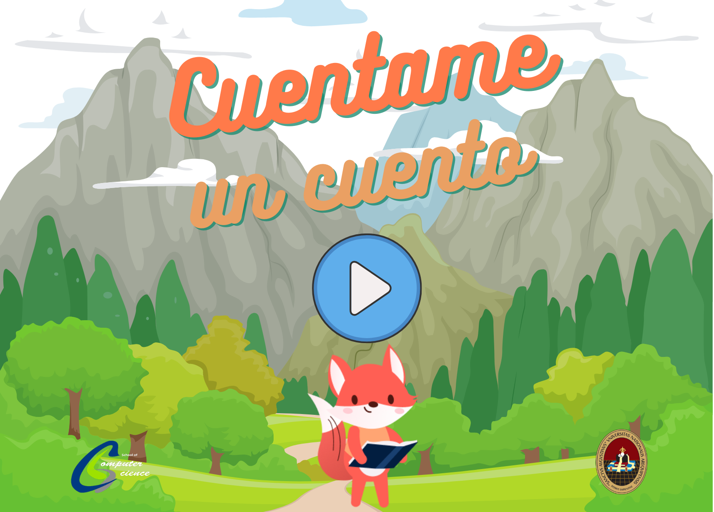

# Cuentame un cuento 

Descripción

## Screenshots

|     |     |    |
| :-: | :-: |:-: |
|  Scenes | Select objects | Select characters |
|  |   |  |
|  Menu | Question Scene | End Scene |
|  |   |  |

## Installation

To run this project on your own, do the following: 
1. Clone this project.
2. Run `flutter pub get`.
3. Run the project using `flutter run` or using your IDE's tools.

For help getting started with Flutter, view our
[online documentation](https://flutter.dev/docs), which offers tutorials,
samples, guidance on mobile development, and a full API reference.

## Contributing
Pull requests are welcome. For major changes, please open an issue first to discuss what you would like to change.

Please make sure to update tests as appropriate.

## License
[License MIT](https://choosealicense.com/licenses/mit/)
